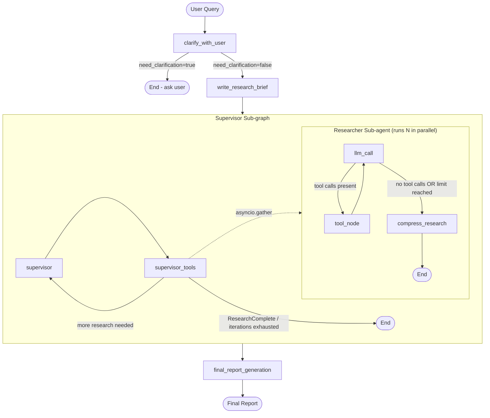

# 🔬 Deep Research Agent

A multi-agent AI research pipeline that takes a user's natural-language question, optionally clarifies ambiguities, generates a structured research brief, delegates parallel web searches to specialized sub-agents, and synthesises all findings into a comprehensive, cited Markdown report — served through a live-streaming Streamlit UI.

---

## Overview

Most LLM chatbots answer questions from pre-trained knowledge alone. **Deep Research Agent** goes further: it actively searches the web, manages multiple parallel researcher sub-agents, compresses and curates findings, and produces a structured long-form report with inline citations and a sources section.

The system is built on **LangGraph** (for stateful multi-agent orchestration), **LangChain** (for model-agnostic LLM calls and tool binding), and the **Tavily** search API (for real-time web retrieval). The complete pipeline runs end-to-end asynchronously and streams its progress live in the UI.

---

## Features

- **Optional query clarification** — before any research begins, the system decides whether the user's request is specific enough or whether a single clarifying question is needed.
- **Structured research brief generation** — the conversation history is distilled into a detailed, self-contained research brief that drives all downstream work.
- **Supervisor-orchestrated research** — a supervisor LLM plans which sub-topics to investigate, decides how many researchers to spawn in parallel, and decides when research is complete.
- **Parallel researcher sub-agents** — each researcher runs its own ReAct loop (LLM → tool call → observe → repeat) independently, with an isolated context window.
- **Tavily web search with LLM summarisation** — raw webpage content is retrieved via the Tavily API and summarised per-page by a dedicated summarisation model before being passed to the researcher.
- **Think-tool for strategic reflection** — both the supervisor and individual researchers use a `think_tool` to pause, reflect on current findings, and plan next steps, creating deliberate decision points in the loop.
- **Research compression** — after each researcher finishes its ReAct loop, a compression model condenses its full message history into a clean, comprehensive findings report with inline citations.
- **Final report synthesis** — a separate writer model merges all compressed findings and produces a formatted Markdown report matching the original research brief, written in the same language as the user's input.
- **Configurable models per role** — the UI exposes four independent model selectors (Research, Final Report, Compression, Summarisation), each supporting Anthropic, Google Gemini, OpenAI, and Groq providers.
- **Live streaming UI** — every pipeline stage streams output in real time via collapsible `st.status` containers; the final report is displayed inline and available for download as a `.md` file.
- **Pipeline graph visualiser** — a dedicated tab renders the compiled LangGraph as a live interactive Mermaid.js diagram, with an option to expand sub-graphs.
- **Clickable citations** — `[N]` citation markers in the final report are automatically converted to HTML anchor links pointing to the original source URLs.

---

## Architecture

The system is composed of two nested LangGraph state machines plus four top-level workflow nodes.



### Component Breakdown

| Component | File | Role |
|---|---|---|
| **Full Agent** | `deepresearch/agents/full_agent.py` | Compiles the top-level `StateGraph`; wires all four nodes together |
| **Clarification Node** | `deepresearch/agents/scoping_agent.py` | Decides whether to ask a clarifying question or proceed |
| **Brief Writer Node** | `deepresearch/agents/scoping_agent.py` | Converts conversation history into a structured research brief |
| **Supervisor Sub-graph** | `deepresearch/agents/supervisor_agent.py` | Plans research tasks, launches parallel researchers, and determines when research is done |
| **Researcher Sub-agent** | `deepresearch/agents/research_agent.py` | Performs iterative web searches via a ReAct loop; compresses findings on exit |
| **Final Report Node** | `deepresearch/agents/full_agent.py` | Synthesises all compressed findings into a formatted Markdown report |
| **Streamlit UI** | `app.py` | Streams live events, renders staged output, exposes configuration, handles download |
| **State Definitions** | `deepresearch/state.py` | All `TypedDict` / `MessagesState` classes and Pydantic structured-output schemas |
| **Prompts** | `deepresearch/prompt.py` | All system prompts and human-message templates |
| **Utilities** | `deepresearch/utils.py` | Tavily search tool, webpage summarisation, deduplication, formatting, `think_tool` |

---

## Workflow

Here is exactly what happens when a user submits a research request:

1. **User submits a query** via the Streamlit chat input.

2. **Clarification check** (`clarify_with_user`): The model evaluates the conversation history using structured output (`ClarifyWithUser` schema). If `need_clarification=true`, the pipeline ends and presents a single clarifying question to the user. If `need_clarification=false` (or if the user has already answered a previous question, or if the feature is disabled), the pipeline continues. The `allow_clarification` flag in the sidebar can bypass this step entirely.

3. **Research brief generation** (`write_research_brief`): The full conversation history is passed to the model, which produces a detailed, standalone research brief (`ResearchQuestion` schema). This brief is stored in `AgentState.research_brief` and injected into the supervisor's initial message.

4. **Supervisor planning loop** (`supervisor` node): The supervisor LLM receives the research brief and uses three tools:
   - `think_tool` — to plan its approach before and after each research delegation.
   - `ConductResearch` — to delegate a specific research topic to a sub-agent.
   - `ResearchComplete` — to signal that all necessary research has been gathered.

   The supervisor loops through `supervisor → supervisor_tools` until it calls `ResearchComplete`, makes no tool calls, or exhausts the configured iteration limit.

5. **Parallel researcher execution** (`supervisor_tools` node): For each `ConductResearch` tool call in a single supervisor response, an independent `researcher_agent` is launched concurrently using `asyncio.gather`. Each researcher runs with its own isolated `ResearcherState`.

6. **Researcher ReAct loop** (inside each researcher sub-agent):
   - **`llm_call`**: The researcher LLM decides which search queries to run (or uses `think_tool` to reflect).
   - **`tool_node`**: Executes all tool calls: `tavily_search` (web search + per-page LLM summarisation) and/or `think_tool`.
   - **Routing** (`should_continue`): If there are pending tool calls and the iteration budget (`max_react_tool_calls`) has not been exceeded, the loop returns to `llm_call`. Otherwise it routes to `compress_research`.
   - **`compress_research`**: The researcher's full message history is compressed into a clean findings document with inline citations. Raw notes (all tool and AI message content) are also extracted and stored.

7. **Result aggregation**: Each researcher's `compressed_research` is returned to the supervisor as the content of a `ToolMessage`. The supervisor accumulates these across iterations.

8. **Final report generation** (`final_report_generation`): The writer model receives the original research brief and all compressed notes. It produces a structured Markdown report with proper headings, inline citations in `[Title](URL)` format, and a `### Sources` section.

9. **UI rendering**: The report is displayed in a scrollable container, citation markers are converted to clickable HTML links, and a download button is offered for the `.md` file.

---

## Agents

### Clarification Agent (`clarify_with_user`)

- **Purpose**: Gate-keeper that determines whether the user's request has sufficient specificity to begin research.
- **Input**: Full `AgentState.messages` conversation history.
- **Output**: Either routes to `write_research_brief` (research proceeds) or terminates with a clarifying question appended to `messages`.
- **Mechanism**: Uses `model.with_structured_output(ClarifyWithUser)` to produce a deterministic boolean decision along with either a `question` or a `verification` message.
- **Config**: Respects the `allow_clarification` configurable; when `False`, it immediately routes to brief writing without calling the LLM.
- **Tools used**: None. Pure structured LLM call.

---

### Brief Writer (`write_research_brief`)

- **Purpose**: Translates the conversation (including any clarifying Q&A) into a comprehensive, self-contained research brief.
- **Input**: `AgentState.messages`.
- **Output**: Writes `research_brief` to `AgentState` and injects it as the first `HumanMessage` into `AgentState.supervisor_messages`.
- **Mechanism**: Uses `model.with_structured_output(ResearchQuestion)`. The prompt instructs the model to maximize specificity, preserve all user details, avoid unwarranted assumptions, and express the brief in first-person from the user's perspective.
- **Tools used**: None. Pure structured LLM call.

---

### Supervisor Agent (`supervisor` + `supervisor_tools`)

- **Purpose**: Plans the research strategy, delegates tasks to researcher sub-agents in parallel, and determines when research is complete.
- **Input**: `SupervisorState` (research brief + accumulated supervisor messages).
- **Output**: Accumulated `notes` (compressed researcher findings) passed back to `AgentState`.

**`supervisor` node**:
- Binds the research model to `[ConductResearch, ResearchComplete, think_tool]`.
- Formats the `lead_researcher_prompt` with today's date, `max_concurrent_research_units`, and `max_researcher_iterations`.
- Calls the model and routes unconditionally to `supervisor_tools`.

**`supervisor_tools` node**:
- Inspects the supervisor's latest tool calls.
- **Termination conditions**: `ResearchComplete` called, no tool calls, or `research_iterations >= max_researcher_iterations`. On termination, calls `get_notes_from_tool_calls()` to extract all `ToolMessage` content (compressed research) into `notes`.
- **`think_tool` calls**: Executed synchronously inline.
- **`ConductResearch` calls**: All calls in one supervisor turn are dispatched to `researcher_agent.ainvoke()` concurrently via `asyncio.gather`, each receiving an isolated `ResearcherState`.
- Results are formatted as `ToolMessage` objects and returned to the supervisor's message history.

**Tools available to supervisor**: `ConductResearch`, `ResearchComplete`, `think_tool`.

---

### Researcher Sub-agent (`llm_call` → `tool_node` → `compress_research`)

- **Purpose**: Investigates a specific research topic through iterative web search and reflection.
- **Input**: `ResearcherState` with a single `HumanMessage` containing the research topic (as delegated by the supervisor).
- **Output**: `ResearcherOutputState` with `compressed_research` (clean findings with citations) and `raw_notes` (raw tool + AI message content).

**`llm_call` node**:
- Binds the research model to `[tavily_search, think_tool]`.
- Receives `research_system_prompt` as a `SystemMessage`.
- Returns the model's response (possibly with tool calls) appended to `researcher_messages`.

**`tool_node` node**:
- Iterates through all tool calls in the last message and executes each tool.
- Increments `tool_call_iterations`.
- Returns `ToolMessage` objects for each result.

**`should_continue` router**:
- Returns `"tool_node"` if the last message has tool calls and `tool_call_iterations < max_react_tool_calls`.
- Returns `"compress_research"` otherwise.

**`compress_research` node**:
- Invokes the compression model with the full researcher message history.
- Uses `compress_research_system_prompt` (preserve all findings verbatim, include all sources, format as: queries made → findings → sources).
- Also extracts all `ToolMessage` and `AIMessage` content as `raw_notes` for the supervisor to store.

**Tools available to researcher**: `tavily_search`, `think_tool`.

---

### Final Report Node (`final_report_generation`)

- **Purpose**: Synthesises all compressed research notes into a single polished report.
- **Input**: `AgentState.research_brief` + `AgentState.notes` (list of compressed findings from all researchers across all supervisor iterations).
- **Output**: `AgentState.final_report` (a Markdown string).
- **Mechanism**: Concatenates all notes, formats `final_report_generation_prompt`, and calls the writer model with a single `HumanMessage`. The prompt instructs the model to: use proper Markdown headings, write in the same language as the user's messages, include inline citations, and append a `### Sources` section.
- **Tools used**: None.

---

## State Management

State flows through three distinct `TypedDict` / `MessagesState` classes:

### `AgentState` (top-level graph)

```python
class AgentState(MessagesState):
    research_brief: Optional[str]              # Generated by write_research_brief
    supervisor_messages: Sequence[BaseMessage] # Accumulates supervisor turns (add_messages)
    raw_notes: list[str]                       # Raw content from all researchers (operator.add)
    notes: list[str]                           # Compressed findings from all researchers (operator.add)
    final_report: str                          # Final synthesised report
```

`AgentInputState` (a plain `MessagesState`) is used as the *input schema*, meaning only `messages` is required at invocation time.

### `SupervisorState` (supervisor sub-graph)

```python
class SupervisorState(TypedDict):
    supervisor_messages: Sequence[BaseMessage] # Supervisor conversation (add_messages)
    research_brief: str
    notes: list[str]                           # Accumulated compressed findings (operator.add)
    research_iterations: int                   # Tracks supervisor loop count
    raw_notes: list[str]                       # Raw researcher notes (operator.add)
```

### `ResearcherState` / `ResearcherOutputState` (researcher sub-agent)

```python
class ResearcherState(TypedDict):
    researcher_messages: Sequence[BaseMessage] # Researcher conversation (add_messages)
    tool_call_iterations: int                  # Tracks tool call budget usage
    research_topic: str
    compressed_research: str                   # Filled by compress_research node
    raw_notes: list[str]                       # Raw notes (operator.add)

class ResearcherOutputState(TypedDict):
    compressed_research: str
    raw_notes: list[str]
    researcher_messages: Sequence[BaseMessage]
```

### Annotated reducers

All list fields that accumulate across graph invocations use `Annotated[list[str], operator.add]` (appending) or `Annotated[Sequence[BaseMessage], add_messages]` (LangGraph's message deduplication reducer).

---

## LangGraph

LangGraph is the core orchestration framework. The project uses:

- **`StateGraph`**: Three separate graphs are compiled — the top-level full agent, the supervisor sub-graph, and the researcher sub-agent. Each graph has its own state schema.
- **`input_schema`**: The full agent and scoping agent use `input_schema=AgentInputState` to enforce a minimal input contract (only `messages` needed at invocation time).
- **`output_schema`**: The researcher agent uses `output_schema=ResearcherOutputState` to expose only the relevant fields to the supervisor.
- **`START` / `END`**: Standard entry and exit nodes wiring the graphs.
- **Conditional edges** (`add_conditional_edges`): Used in the researcher sub-agent between `llm_call` and either `tool_node` or `compress_research`, driven by the `should_continue` router function.
- **`Command`**: Used by `clarify_with_user`, `supervisor`, and `supervisor_tools` to dynamically control both the next node (`goto`) and the state update in a single return value.
- **Nested sub-graphs**: The supervisor sub-graph is registered as a node (`supervisor_subgraph`) in the top-level graph via `supervisor_builder.compile()`. Multiple researcher agents run as ephemeral sub-graph invocations via `asyncio.gather`.
- **`astream_events`**: The Streamlit UI consumes events via `agent.astream_events(..., version="v2")`, enabling fine-grained streaming by node name, event type, and LangGraph node metadata.
- **`get_graph(xray=True)`**: Used to introspect and render the compiled graph as a Mermaid diagram.

---

## LangChain

LangChain is used for:

- **`init_chat_model(model_name, temperature=...)`**: Provider-agnostic model initialisation. The `model_name` string uses `provider:model-id` format (e.g., `"groq:llama-3.3-70b-versatile"`, `"anthropic:claude-sonnet-4-6"`, `"google_genai:gemini-2.5-flash"`). This is the only model initialisation pattern used across the entire codebase.
- **`model.bind_tools(tools)`**: Used to attach the `[tavily_search, think_tool]` tool list to researcher models, and `[ConductResearch, ResearchComplete, think_tool]` to the supervisor model.
- **`model.with_structured_output(Schema)`**: Used by `clarify_with_user` (`ClarifyWithUser` schema) and `write_research_brief` (`ResearchQuestion` schema) for deterministic, schema-validated LLM outputs.
- **`@tool(parse_docstring=True)`**: Used to define `tavily_search` as a LangChain tool with injected arguments (`InjectedToolArg`) for `config`, `max_results`, and `topic`.
- **`SystemMessage`, `HumanMessage`, `AIMessage`, `ToolMessage`**: The full LangChain message hierarchy is used throughout the graph.
- **`filter_messages`**: Used to extract only `ToolMessage` objects from supervisor history (to compile notes) and to extract `tool` + `ai` messages from researcher history (for raw notes).
- **`get_buffer_string`**: Used by `clarify_with_user` and `write_research_brief` to format the message history as a plain string for prompt injection.
- **`RunnableConfig`**: Passed through every node function to propagate configurable settings (model names, iteration limits) without global state.

---

## LLM / Model Configuration

The system supports **four LLM providers** and assigns a **separate model to each functional role**:

| Role | Purpose | Default |
|---|---|---|
| `research_model` | Clarification, brief writing, supervisor planning, researcher LLM calls | `groq:llama-3.3-70b-versatile` |
| `final_report_model` | Final report synthesis | `groq:qwen/qwen3-32b` |
| `compression_model` | Compressing each researcher's findings | `groq:qwen/qwen3-32b` |
| `summarization_model` | Summarising individual Tavily search results per page | `groq:qwen/qwen3-32b` |

**Supported providers and models** (selectable in the sidebar):

| Provider | Models |
|---|---|
| **Anthropic** | `claude-opus-4-7`, `claude-sonnet-4-6`, `claude-haiku-4-5-20251001` |
| **Gemini** | `gemini-2.5-pro`, `gemini-2.5-flash`, `gemini-2.0-flash`, `gemini-1.5-pro`, `gemini-1.5-flash` |
| **OpenAI** | `gpt-4.1`, `gpt-4.1-mini`, `gpt-4o`, `gpt-4o-mini`, `o4-mini` |
| **Groq** | `llama-3.3-70b-versatile`, `deepseek-r1-distill-llama-70b`, `llama-3.1-8b-instant`, `mixtral-8x7b-32768`, `gemma2-9b-it` |

All four model roles are independently configurable per provider via the Streamlit sidebar. They are passed to every node through `RunnableConfig.configurable` and retrieved with `config.get("configurable", {}).get("model_role", DEFAULT)`.

---

## Tools / Search / Research

### `tavily_search` tool

Defined in `deepresearch/utils.py` as a `@tool`-decorated LangChain tool. Called by researcher sub-agents during their ReAct loop.

**Execution pipeline per search call:**

1. **Query**: A single `query` string is submitted to the Tavily API via `TavilyClient.search()`, requesting `include_raw_content=True`.
2. **Deduplication**: Results are deduplicated by URL (`deduplicate_search_results`).
3. **Per-page summarisation**: For each unique result that has `raw_content`, the raw HTML/text (truncated to 5,000 characters) is passed to the `summarization_model` via `summarize_webpage_content()`. This uses `model.with_structured_output(Summary)` to extract a structured `summary` and `key_excerpts`.
4. **Formatting**: Results are formatted as a numbered `SOURCE N` block with title, URL, and summarised content (`format_search_output`).
5. **Return**: The formatted string is returned as the `ToolMessage` content visible to the researcher LLM.

Results default to `max_results=3` per query and `topic="general"`. The `topic` and `max_results` parameters are injected via `InjectedToolArg` (not exposed to the LLM).

### `think_tool`

A lightweight reflection tool available to both researchers and the supervisor. It accepts a `reflection` string and returns `"Reflection recorded: {reflection}"`. Its purpose is to force the model into an explicit reasoning step between actions — examining what was found, what is missing, and whether to continue searching.

### External API requirements

| Service | Purpose | Environment variable |
|---|---|---|
| **Tavily** | Real-time web search | `TAVILY_API_KEY` |
| **Anthropic** | Claude model calls | `ANTHROPIC_API_KEY` |
| **Google AI** | Gemini model calls | `GOOGLE_API_KEY` |
| **OpenAI** | GPT model calls | `OPENAI_API_KEY` |
| **Groq** | Groq-hosted model calls | `GROQ_API_KEY` |

Only the API keys for the providers actually selected in the UI need to be set.

---

## Project Structure

```text
DeepResearchAgent/
├── app.py                          # Streamlit UI: streaming, configuration, citation rendering
├── scratch_run.py                  # Standalone async CLI runner (no Streamlit dependency)
│
├── deepresearch/
│   ├── agents/
│   │   ├── full_agent.py           # Top-level StateGraph: wires all 4 nodes; exports `agent`
│   │   ├── supervisor_agent.py     # Supervisor sub-graph: supervisor + supervisor_tools nodes
│   │   ├── research_agent.py       # Researcher sub-agent: llm_call + tool_node + compress_research
│   │   └── scoping_agent.py        # Clarification + brief writing nodes
│   ├── prompt.py                   # All system prompts and human-message templates
│   ├── state.py                    # TypedDicts, MessagesState subclasses, Pydantic schemas
│   └── utils.py                    # tavily_search tool, think_tool, summarisation helpers
│
├── notebooks/
│   ├── agent1.ipynb                # Prototype: scoping agent (clarify + brief writer)
│   ├── agent2.ipynb                # Prototype: researcher sub-agent with ReAct loop
│   ├── agent3.ipynb                # Prototype: supervisor sub-graph
│   ├── agent4.ipynb                # Integration: full pipeline assembled in notebook
│   ├── agent5.ipynb                # Integration: full agent imported from module + multi-turn test
│   └── utils.py                    # Rich-formatted message display helpers for notebooks
│
├── pyproject.toml                  # Project metadata (Python >= 3.11, python-dotenv dependency)
├── requirements.txt                # Pinned dependency lockfile
├── uv.lock                         # uv package manager lockfile
├── .python-version                 # Pins Python 3.11
├── .gitignore                      # Excludes .venv, __pycache__, .env
└── README.md
```

---

## Installation & Setup

### Prerequisites

- Python 3.11+
- A [Tavily API key](https://tavily.com/) (required for search)
- An API key for at least one supported LLM provider (Groq, Anthropic, Google AI, or OpenAI)

### Install dependencies

```bash
# Using uv (recommended — uses the provided lockfile)
pip install uv
uv sync

# Or using pip
pip install -r requirements.txt
```

### Configure environment variables

Create a `.env` file in the project root:

```env
TAVILY_API_KEY=tvly-...

# Set only the keys for the providers you intend to use
GROQ_API_KEY=gsk_...
ANTHROPIC_API_KEY=sk-ant-...
GOOGLE_API_KEY=AIza...
OPENAI_API_KEY=sk-...
```

The application calls `load_dotenv()` before importing any LangChain or provider packages, so keys are always available at startup.

---

## Running the Application

### Streamlit UI

```bash
streamlit run app.py
```

Open `http://localhost:8501` in your browser.

### Standalone CLI runner

```bash
python scratch_run.py
```

This runs the full pipeline headlessly, prints the final report to stdout, and requires no Streamlit. Useful for testing.

---

## Configuration (Streamlit Sidebar)

| Setting | Description | Default |
|---|---|---|
| **Provider** | LLM provider for all roles | Anthropic |
| **Research Agent** | Model for clarification, briefs, supervisor, and researchers | Provider-dependent |
| **Final Report Agent** | Model for report synthesis | Provider-dependent |
| **Compression Agent** | Model for compressing researcher findings | Provider-dependent |
| **Summarization Agent** | Model for per-page search result summarisation | Provider-dependent |
| **Allow Clarification Questions** | Enable/disable the clarification gate | `True` |
| **Max Concurrent Researchers** | Parallel researcher agents per supervisor iteration | `3` |
| **Supervisor Max Iterations** | Maximum rounds of research the supervisor can run | `6` |
| **Max Tool Calls / Researcher** | Maximum `tavily_search` + `think_tool` calls per researcher | `5` |

---

## Notebooks

The `notebooks/` directory contains the iterative development history of the system, built up component by component:

| Notebook | Content |
|---|---|
| `agent1.ipynb` | Prototype of the **scoping agent**: `clarify_with_user` and `write_research_brief` nodes with `InMemorySaver` checkpointing for multi-turn conversation. |
| `agent2.ipynb` | Prototype of the **researcher sub-agent**: full ReAct loop (`llm_call` -> `tool_node` -> `compress_research`) with Tavily search and think_tool. |
| `agent3.ipynb` | Prototype of the **supervisor sub-graph**: supervisor planning loop with parallel `ConductResearch` delegation. |
| `agent4.ipynb` | **Full pipeline integration** assembled directly in the notebook, demonstrating the complete four-stage workflow. |
| `agent5.ipynb` | **Module-level integration**: imports the compiled `agent` from `deepresearch.agents.full_agent` and runs multi-turn research queries. |

All notebooks import from the `deepresearch/` package and use `notebooks/utils.py` for Rich-formatted message display during development.

---

## Dependencies

Key runtime dependencies (see `requirements.txt` for pinned versions):

| Package | Purpose |
|---|---|
| `langchain` | Model-agnostic LLM interface, tools, message types |
| `langchain-core` | Core abstractions (runnables, messages, tools) |
| `langchain-groq` | Groq provider integration |
| `langgraph` | Multi-agent stateful graph orchestration |
| `langgraph-prebuilt` | Pre-built LangGraph utilities |
| `tavily-python` | Tavily search API client |
| `streamlit` | Web UI framework |
| `pydantic` | Structured output schemas |
| `python-dotenv` | `.env` file loading |
| `groq` | Groq SDK (used by langchain-groq) |
| `nest-asyncio` | Jupyter async compatibility |
| `tiktoken` | Token counting |

---

## License

*No license file is currently present in the repository.*
